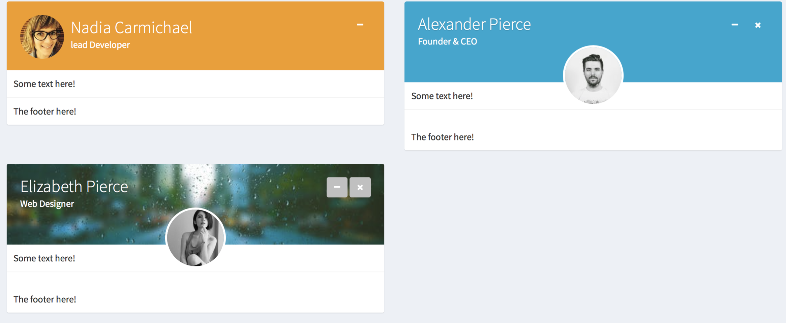
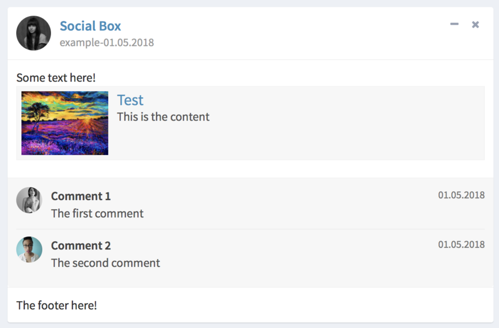

# shinydashboardPlus
> extensions for shinydashboard

[](https://travis-ci.org/DivadNojnarg/shinydashboardPlus)

## Installation

```{r}
devtools::install_github("DivadNojnarg/shinydashboardPlus")
```

## Motivations

shinydashboardPlus is based on the idea of [ygdashboard](https://github.com/gyang274/ygdashboard/tree/master/R), 
the later not compatible with shinydashboard (you cannot use shinydashboard and ygdashboard at the same time). With shinydashboardPlus you can still work with the shinydashboard classic functions and enrich
your dashboard with all additional functions of shinydashboardPlus!

## Main features

### The rightSidebar()

The most interesting feature of this package is the **rightSidebar**. This concept was
not implemented (in R) in ygdashboard (pure HTML), that's why I translated 
the corresponding HTML code to R. To use it, you will have to replace **dashboardPage**
by **dashboardPagePlus** and **dashboardHeader** by **dashboardHeaderPlus**. Creating this
two additional functions let you choose whether you want to use this extra sidebar or not.

The template below will create the most basic shinydashboardPlus page:

```{r}
library(shiny)
library(shinydashboard)
library(shinydashboardPlus)
shinyApp(
  ui = dashboardPagePlus(
    header = dashboardHeaderPlus(
     enable_rightsidebar = TRUE,
     rightSidebarIcon = "gears"
    ),
    sidebar = dashboardSidebar(),
    body = dashboardBody(),
    rightsidebar = rightSidebar(),
    title = "DashboardPage"
  ),
  server = function(input, output) { }
)
```

The rightSidebar function takes the following arguments:

- background: you can display it either in light or dark mode
- rightSidebarTabList() will create a menu for your tabPanels. Populate it with
rightSidebarTabItem(), with a **unique id** and icons
- rightSidebarPanel is the body of your panels. Fill it with rightSidebarTabContent(),
which id should be the same as in the rightSidebarTabItem(). You can include inputs,
text or custom HTML elements.
- in the **dashboardHeaderPlus()** function, you can customize the sidebar trigger.

```{r}
rightSidebar(
 background = "dark",
  rightSidebarTabList(
   rightSidebarTabItem(
    id = 1,
    icon = "desktop"
   ),
   rightSidebarTabItem(
    id = 2
   ),
   rightSidebarTabItem(
    id = 3,
    icon = "paint-brush"
   )
  ),
  rigthSidebarPanel(
   rightSidebarTabContent(
    id = 1,
    title = "Tab 1",
    sliderInput(
     "obs", 
     "Number of observations:",
      min = 0, max = 1000, value = 500
     )
   ),
   rightSidebarTabContent(
    id = 2,
    title = "Tab 2",
    textInput("caption", "Caption", "Data Summary")
   ),
   rightSidebarTabContent(
    id = 3,
    title = "Tab 3",
    numericInput("obs", "Observations:", 10, min = 1, max = 100)
   )
  )
)
```

**WARNINGS**: there is a limitation of a maximum of **5** rightSidebarTabItem() in the
rightSidebarTabList()! This makes sense since above, the rightSidebar would not
be easy to use.

## Other components

### Improved boxes


```{r}
library(shiny)
library(shinydashboard)

 shinyApp(
   ui = dashboardPagePlus(
     dashboardHeaderPlus(),
     dashboardSidebar(),
     dashboardBody(
      fluidRow(
       boxPlus(
        title = "Closable Box", 
         closable = TRUE, 
         label_status = "danger",
         status = "warning", 
         solidHeader = FALSE, 
         collapsible = TRUE,
         p("Box Content")
       ),
       boxPlus(
        title = "Closable box, with label", 
         closable = TRUE, 
         enable_label = TRUE,
         label_text = 1,
         label_status = "danger",
         status = "warning", 
         solidHeader = FALSE, 
         collapsible = TRUE,
         p("Box Content")
       )
     )
    )
   ),
   server = function(input, output) {}
 )
```


```{r}
library(shiny)
 library(shinydashboard)
 shinyApp(
  ui = dashboardPage(
    dashboardHeader(),
    dashboardSidebar(),
    dashboardBody(
     gradientBox(
      title = "My gradient Box",
      icon = "fa fa-th",
      gradientColor = "teal", 
      boxToolSize = "sm", 
      footer = sliderInput(
       "obs", 
       "Number of observations:",
        min = 0, max = 1000, value = 500
       ),
      "This is a gradient box"
      ),
      gradientBox(
      title = "My gradient Box",
      icon = "fa fa-heart",
      gradientColor = "maroon", 
      boxToolSize = "xs", 
      closable = TRUE,
      footer = "The footer goes here. You can include anything",
      "This is a gradient box"
      )
    ),
    title = "Description Blocks"
  ),
  server = function(input, output) { }
 )
```



```{r}
 library(shiny)
 library(shinydashboard)
 shinyApp(
  ui = dashboardPage(
    dashboardHeader(),
    dashboardSidebar(),
    dashboardBody(
     widgetUserBox(
      title = "Nadia Carmichael",
      subtitle = "lead Developer",
      type = 2,
      src = "https://adminlte.io/themes/AdminLTE/dist/img/user7-128x128.jpg",
      color = "yellow",
      "Some text here!",
      footer = "The footer here!"
     ),
     widgetUserBox(
      title = "Alexander Pierce",
      subtitle = "Founder & CEO",
      type = NULL,
      src = "https://adminlte.io/themes/AdminLTE/dist/img/user1-128x128.jpg",
      color = "aqua-active",
      closable = TRUE,
      "Some text here!",
      footer = "The footer here!"
     ),
     widgetUserBox(
      title = "Elizabeth Pierce",
      subtitle = "Web Designer",
      type = NULL,
      src = "https://adminlte.io/themes/AdminLTE/dist/img/user3-128x128.jpg",
      background = TRUE,
      backgroundUrl = "https://images.pexels.com/photos/531880/pexels-photo-531880.jpeg?auto=compress&cs=tinysrgb&h=350",
      closable = TRUE,
      "Some text here!",
      footer = "The footer here!"
     )
    ),
    title = "Description Blocks"
  ),
  server = function(input, output) { }
 )
```



```{r}
library(shiny)
 library(shinydashboard)
 shinyApp(
  ui = dashboardPage(
    dashboardHeader(),
    dashboardSidebar(),
    dashboardBody(
     socialBox(
      title = "Social Box",
      subtitle = "example-01.05.2018",
      src = "https://adminlte.io/themes/AdminLTE/dist/img/user4-128x128.jpg",
      "Some text here!",
      attachmentBlock(
       src = "http://kiev.carpediem.cd/data/afisha/o/2d/c7/2dc7670333.jpg",
       title = "Test",
       title_url = "http://google.com",
       "This is the content"
      ),
      comments = tagList(
       boxComment(
        src = "https://adminlte.io/themes/AdminLTE/dist/img/user3-128x128.jpg",
        title = "Comment 1",
        date = "01.05.2018",
        "The first comment"
       ),
       boxComment(
        src = "https://adminlte.io/themes/AdminLTE/dist/img/user5-128x128.jpg",
        title = "Comment 2",
        date = "01.05.2018",
        "The second comment"
       )
      ),
      footer = "The footer here!"
     )
    ),
    title = "Description Blocks"
  ),
  server = function(input, output) { }
 )
```

### Boxes components


```{r}
library(shiny)
 library(shinydashboard)
 shinyApp(
  ui = dashboardPage(
    dashboardHeader(),
    dashboardSidebar(),
    dashboardBody(
     box(
      solidHeader = FALSE,
      title = "Status summary",
      background = NULL,
      width = 4,
      status = "danger",
      footer = fluidRow(
        column(
          width = 6,
          descriptionBlock(
            number = "17%", 
            number_color = "green", 
            number_icon = "fa fa-caret-up",
            header = "$35,210.43", 
            text = "TOTAL REVENUE", 
            right_border = TRUE,
            margin_bottom = FALSE
          )
        ),
        column(
          width = 6,
          descriptionBlock(
            number = "18%", 
            number_color = "red", 
            number_icon = "fa fa-caret-down",
            header = "1200", 
            text = "GOAL COMPLETION", 
            right_border = FALSE,
            margin_bottom = FALSE
          )
        )
      )
     )
    ),
    title = "Description Blocks"
  ),
  server = function(input, output) { }
 )
```


```{r}
library(shiny)
 library(shinydashboard)
 shinyApp(
  ui = dashboardPage(
    dashboardHeader(),
    dashboardSidebar(),
    dashboardBody(
     box(title = "Box with right pad",
      status = "warning",
      fluidRow(
        column(width = 6),
        column(
          width = 6,
          boxPad(
            color = "green",
            descriptionBlock(
              header = "8390", 
              text = "VISITS", 
              right_border = FALSE,
              margin_bottom = TRUE
            ),
            descriptionBlock(
              header = "30%", 
              text = "REFERRALS", 
              right_border = FALSE,
              margin_bottom = TRUE
            ),
            descriptionBlock(
              header = "70%", 
              text = "ORGANIC", 
              right_border = FALSE,
              margin_bottom = FALSE
            )
          )
        )
      )
     )
    ),
    title = "Description Blocks"
  ),
  server = function(input, output) { }
 )
```

and a lot more (see the demo).


## Demo

See a demonstration [here](http://130.60.24.205/shinydashboardPlus/)
or run:
```{r}
shinydashboardPlusGallery()
```

## Aknowldegments

- the [adminLTE team](https://adminlte.io)
- [Victor Perrier](https://github.com/pvictor) from [Dream'R](https://www.dreamrs.fr)