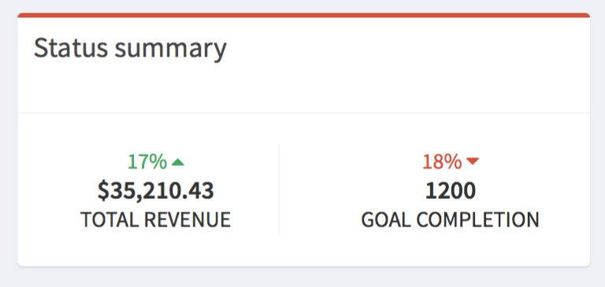
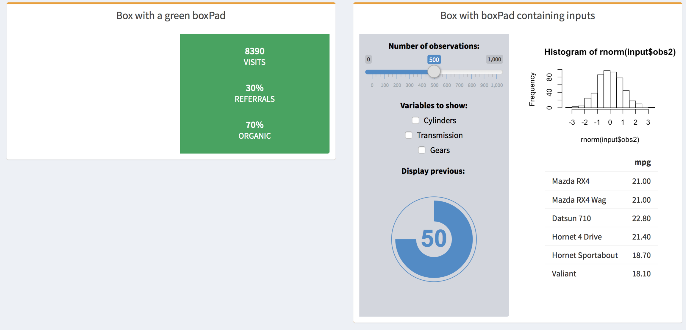

```{r setup, include = FALSE}
knitr::opts_chunk$set(
  collapse = TRUE,
  comment = "#>"
)
```

## Boxes components

**shinydashboardPlus** brings also tons of new elements to include in boxes or elsewhere.

### `descriptionBlock()`



<br>

```r
 library(shiny)
 library(shinydashboard)
 library(shinydashboardPlus)
 
 shinyApp(
  ui = dashboardPage(
    dashboardHeader(),
    dashboardSidebar(),
    dashboardBody(
     box(
      solidHeader = FALSE,
      title = "Status summary",
      background = NULL,
      width = 4,
      status = "danger",
      footer = fluidRow(
        column(
          width = 6,
          descriptionBlock(
            number = "17%", 
            number_color = "green", 
            number_icon = "fa fa-caret-up",
            header = "$35,210.43", 
            text = "TOTAL REVENUE", 
            right_border = TRUE,
            margin_bottom = FALSE
          )
        ),
        column(
          width = 6,
          descriptionBlock(
            number = "18%", 
            number_color = "red", 
            number_icon = "fa fa-caret-down",
            header = "1200", 
            text = "GOAL COMPLETION", 
            right_border = FALSE,
            margin_bottom = FALSE
          )
        )
      )
     )
    ),
    title = "Description Blocks"
  ),
  server = function(input, output) { }
 )
```

### `boxPad()`


<br>

```r
 library(shiny)
 library(shinydashboard)
 library(shinydashboardPlus)
 
 shinyApp(
  ui = dashboardPage(
    dashboardHeader(),
    dashboardSidebar(),
    dashboardBody(
     box(title = "Box with right pad",
      status = "warning",
      fluidRow(
        column(width = 6),
        column(
          width = 6,
          boxPad(
            color = "green",
            descriptionBlock(
              header = "8390", 
              text = "VISITS", 
              right_border = FALSE,
              margin_bottom = TRUE
            ),
            descriptionBlock(
              header = "30%", 
              text = "REFERRALS", 
              right_border = FALSE,
              margin_bottom = TRUE
            ),
            descriptionBlock(
              header = "70%", 
              text = "ORGANIC", 
              right_border = FALSE,
              margin_bottom = FALSE
            )
          )
        )
      )
     )
    ),
    title = "Description Blocks"
  ),
  server = function(input, output) { }
 )
```

and a lot more [here](https://rinterface.com/shiny/shinydashboardPlus/).
