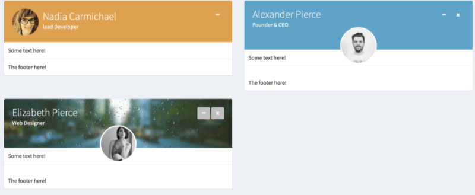

## Boxes on Steroids!

### The box state
`box()` is without any doubt a central component of `{shinydashboard}`. Thanks to the AdminLTE API, `{shinydashboardPlus}` is able to provide more interactivity to this component. For instance, you may:

- Know the state of any box at any time. This state captures different parameters such as
collapsed, closed, ...
- Toggle a box
- Close/Restore a box
- update box properties: title, status, solidHeader, background, width, height, 
collapsible and closable

To benefit from that feature, one must pass the _id_ parameter and access it on the server side with `input$<id>`. Let's consider an example:

```{r boxAPI-code, eval=FALSE}
library(shiny)
library(shinydashboard)
library(shinydashboardPlus)
ui <- dashboardPage(
  title = "Box API",
  dashboardHeader(),
  dashboardSidebar(),
  dashboardBody(
    tags$style("body { background-color: ghostwhite}"),
    fluidRow(
      actionButton("toggle_box", "Toggle Box"),
      actionButton("remove_box", "Remove Box", class = "bg-danger"),
      actionButton("restore_box", "Restore Box", class = "bg-success"),
      actionButton("update_box", "Update Box", class = "bg-primary")
    ),
    br(),
    box(
      title = textOutput("box_state"),
      "Box body",
      id = "mybox",
      collapsible = TRUE,
      closable = TRUE,
      plotOutput("plot")
    )
  )
)

server <- function(input, output, session) {
  output$plot <- renderPlot({
    req(!input$mybox$collapsed)
    plot(rnorm(200))
  })

  output$box_state <- renderText({
    state <- if (input$mybox$collapsed) "collapsed" else "uncollapsed"
    paste("My box is", state)
  })

  observeEvent(input$toggle_box, {
    updateBox("mybox", action = "toggle")
  })

  observeEvent(input$remove_box, {
    updateBox("mybox", action = "remove")
  })

  observeEvent(input$restore_box, {
    updateBox("mybox", action = "restore")
  })

  observeEvent(input$update_box, {
    updateBox(
      "mybox",
      action = "update",
      options = list(
        title = h2("New title", dashboardLabel(1, status = "primary")),
        status = "danger",
        solidHeader = TRUE,
        width = 4
      )
    )
  })

  observeEvent(input$mybox$visible, {
    collapsed <- if (input$mybox$collapsed) "collapsed" else "uncollapsed"
    visible <- if (input$mybox$visible) "visible" else "hidden"
    message <- paste("My box is", collapsed, "and", visible)
    showNotification(message, type = "warning", duration = 1)
  })
}

shinyApp(ui, server)
```

We call the `updateBox()` function, specifying the action to accomplish:

- toggle
- remove
- restore
- update

Knowing the state of a box significantly opens new possibilities within the application, thereby increasing interactivity. Additionally, the toggle animation has been speed up (from 0.5s to 0.1s) so as to reduce the latency.

If you want to know more about the underlying mechanisms, have a look at the box widget [documentation](https://github.com/ColorlibHQ/AdminLTE/tree/86990d5b48f5b9d747ee14d67df7bb200ffc6f85/documentation). 

<div class="marvel-device ipad black">
<div class="camera"></div>
<div class="screen">
<iframe width="100%" src="https://dgranjon.shinyapps.io/shinydashboardPlus-box-api/" allowfullscreen="" frameborder="0" scrolling="no" height="770px"></iframe>
</div>
<div class="home"></div>
</div>


### Box components
With `{shinydashboardPlus}`, you may embed labels, a sidebar and dropdown menus in the 
box header. 

```{r boxTools, echo=FALSE, fig.cap='Box Tools. DFrom left to right: boxLabel, boxDropdown, collapsible and closable buttons, boxSidebar trigger.', fig.align = 'center', out.width='50%'}
knitr::include_graphics("figures/boxTools.png")
``` 

#### Box Labels
`boxLabel()` are passed in the `box()` _label_ slot. They typically contain number or a short text.

#### Box Sidebar
`boxSidebar()` is invoked through the `box()` sidebar parameter. The sidebar has an _id_ allowing to programmatically
toggle it on the server side with `updateBoxSidebar()`. This component is generally used to contain input element that you don't want to show in the box, while the box body generally contains visualizations such as plots or tables. 
`boxSidebar()` is highly customizable as one may change the background color, the width and the icon trigger, the latter displayed on the very right side of the box header, as depicted in Figure \@ref(fig:boxTools). Below is an example showing how to set up the sidebar and toggle it.

```{r boxSidebar-code, eval=FALSE}
shinyApp(
  ui = dashboardPage(
    header = dashboardHeader(),
    body = dashboardBody(
      box(
        title = "Update box sidebar",
        closable = TRUE,
        width = 12,
        height = "500px",
        solidHeader = FALSE,
        collapsible = TRUE,
        actionButton("update", "Toggle card sidebar"),
        sidebar = boxSidebar(
          id = "mycardsidebar",
          width = 25,
          sliderInput(
            "obs",
            "Number of observations:",
            min = 0,
            max = 1000,
            value = 500
          )
        ),
        plotOutput("distPlot")
      )
    ),
    sidebar = dashboardSidebar()
  ),
  server = function(input, output, session) {
    observe(print(input$mycardsidebar))

    output$distPlot <- renderPlot({
      hist(rnorm(input$obs))
    })

    observeEvent(input$update, {
      updateBoxSidebar("mycardsidebar")
    })
  }
)
```

What is the interest of being able to toggle the sidebar on the server? Image you want
to open the sidebar as soon as the user clicks on a specific action button. This is definitely possible.

<div class="marvel-device ipad black">
<div class="camera"></div>
<div class="screen">
<iframe width="100%" src="https://dgranjon.shinyapps.io/shinydashboardPlus-box-sidebar/" allowfullscreen="" frameborder="0" scrolling="yes" height="770px"></iframe>
</div>
<div class="home"></div>
</div>

#### Box Dropdown
`boxDropdown()` is a super powerful tool since all dropdown items may behave like action buttons.
This feature allows to seamlessly add interactivity to the box component and gather features in one place.
In the example below, clicking on the first item triggers a Shiny notification.

```{r boxDropdown-code, eval=FALSE}
shinyApp(
  ui = dashboardPage(
    dashboardHeader(),
    dashboardSidebar(),
    dashboardBody(
      box(
        title = "Closable Box with dropdown",
        closable = TRUE,
        width = 12,
        status = "warning",
        solidHeader = FALSE,
        collapsible = TRUE,
        dropdownMenu = boxDropdown(
          boxDropdownItem("Click me", id = "dropdownItem", icon = icon("heart")),
          boxDropdownItem("item 2", href = "https://www.google.com/"),
          dropdownDivider(),
          boxDropdownItem("item 3", icon = icon("th"))
        ),
        "My box"
      )
    )
  ),
  server = function(input, output) {
    observeEvent(input$dropdownItem, {
      showNotification("Hello", duration = 1, type = "message")
    })
  }
)
```

<div class="marvel-device ipad black">
<div class="camera"></div>
<div class="screen">
<iframe width="100%" src="https://dgranjon.shinyapps.io/shinydashboardPlus-box-dropdown/" allowfullscreen="" frameborder="0" scrolling="yes" height="770px"></iframe>
</div>
<div class="home"></div>
</div>

### Other Boxes
`{shinydashboardPlus}` provides more box components to be able to adapt to various situations. What if you wanted
to create a box with comments, with social content?

#### userBox

`userBox()` is intended to highlight user profiles. It has many common parameters with `box()` and overall the same layout.
The 2 major differences between `box()` and `userBox()` are:

- The ability to add a user image in the box header.
- Optionally add a background image in the box header.
- The _color_ parameter is only applied to the box header.

Additionally, you may also select 2 types: centered image or left-aligned image.

The __title__ argument expects a `userDescription()`:

```{r user-description, eval=FALSE}
userDescription(
  title = "Nadia Carmichael",
  subtitle = "lead Developer",
  type = 2,
  image = "https://adminlte.io/themes/AdminLTE/dist/img/user7-128x128.jpg",
)
```

You may also select 2 types: centered image or left-aligned image, as shown in the Figure below.

```{r userBox, echo=FALSE, fig.cap='Some userBox components', fig.align = 'center', out.width='100%'}

``` 

`userBox()` plays well with other components like `navPills()`, as shown below.

```{r userBox-code, eval=FALSE}
shinyApp(
  ui = dashboardPage(
    dashboardHeader(),
    dashboardSidebar(),
    dashboardBody(
      userBox(
        title = userDescription(
          title = "Nadia Carmichael",
          subtitle = "lead Developer",
          type = 2,
          image = "https://adminlte.io/themes/AdminLTE/dist/img/user7-128x128.jpg",
        ),
        status = "warning",
        navPills(
          id = "pillItem",
          navPillsItem(
            left = "Item 1",
            color = "green",
            right = 10
          ),
          navPillsItem(
            left = "Item 2",
            color = "red",
            icon = icon("angle-down"),
            right = "10%"
          )
        ),
        footer = "The footer here!"
      )
    ),
    title = "userBox"
  ),
  server = function(input, output) {
    observeEvent(input$pillItem, {
      if (input$pillItem == 2) {
        showModal(
          modalDialog("A modal")
        )
      }
    })

    observeEvent(input$pillItem, {
      showNotification(
        sprintf("You clicked on pill N° %s", input$pillItem),
        type = "warning",
        duration = 1
      )
    })
  }
)
```

<div class="marvel-device ipad black">
<div class="camera"></div>
<div class="screen">
<iframe width="100%" src="https://dgranjon.shinyapps.io/shinydashboardPlus-userBox/" allowfullscreen="" frameborder="0" scrolling="yes" height="770px"></iframe>
</div>
<div class="home"></div>
</div>

`userBox()` is also entirely updatable from the server side, as it is built on top the `box()` function:
```{r update-userBox-code, eval=FALSE}
shinyApp(
  ui = dashboardPage(
    dashboardHeader(),
    dashboardSidebar(),
    dashboardBody(
      actionButton("update_box", "Update"),
      userBox(
        id = "userbox",
        title = userDescription(
          title = "Nadia Carmichael",
          subtitle = "lead Developer",
          type = 2,
          image = "https://adminlte.io/themes/AdminLTE/dist/img/user7-128x128.jpg",
        ),
        status = "primary",
        gradient = TRUE,
        background = "light-blue",
        boxToolSize = "xl",
        "Some text here!",
        footer = "The footer here!"
      )
    ),
    title = "userBox"
  ),
  server = function(input, output) {
    observeEvent(input$update_box, {
      updateBox(
        "userbox",
        action = "update",
        options = list(
          title = userDescription(
            title = "Jean Box",
            subtitle = "Developer",
            type = 1,
            image = "https://adminlte.io/themes/AdminLTE/dist/img/user3-128x128.jpg",
          ),
          status = "red",
          background = NULL,
          width = 4
        )
      )
    })
  }
)
```

#### socialBox

A `socialBox()` is dedicated to contain events, comments, anything related to people. 
The __title__ parameter hosts `userBlock()`:

```{r user-block, eval=FALSE}
userBlock(
  image = "https://adminlte.io/themes/AdminLTE/dist/img/user4-128x128.jpg",
  title = "Social Box",
  subtitle = "example-01.05.2018"
)
```

Elements like `attachmentBlock()` and `userMessages()` are a good fit with this component. 
The `...` slot may hosts multiple `boxComment`, consisting in user comments. 
Right now, there is no programmatic way (understand no __update__ function is available) to handle them but a future release of `{shinydashboardPlus}` 
will obviously fill this gap. The app below shows a combination of multiple elements in a 
`socialBox()`, as well as the `updateBox()` feature:


```{r, eval=FALSE}
shinyApp(
  ui = dashboardPage(
    dashboardHeader(),
    dashboardSidebar(),
    dashboardBody(
      socialBox(
        id = "socialbox",
        title = userBlock(
          image = "https://adminlte.io/themes/AdminLTE/dist/img/user4-128x128.jpg",
          title = "Social Box",
          subtitle = "example-01.05.2018"
        ),
        actionButton("update_box", "Refresh"),
        "Some text here!",
        br(),
        tabsetPanel(
          tabPanel(
            "News",
            attachmentBlock(
              image = "https://www.sammobile.com/wp-content/uploads/2017/11/Camel.png",
              title = "Test",
              href = "https://google.com",
              "This is the content"
            )
          ),
          tabPanel(
            "Messages",
            userMessages(
              width = 12,
              status = "danger",
              userMessage(
                author = "Alexander Pierce",
                date = "20 Jan 2:00 pm",
                image = "https://adminlte.io/themes/AdminLTE/dist/img/user1-128x128.jpg",
                type = "received",
                "Is this template really for free? That's unbelievable!"
              ),
              userMessage(
                author = "Sarah Bullock",
                date = "23 Jan 2:05 pm",
                image = "https://adminlte.io/themes/AdminLTE/dist/img/user3-128x128.jpg",
                type = "sent",
                "You better believe it!"
              )
            )
          )
        ),
        lapply(X = 1:10, FUN = function(i) {
          boxComment(
            image = "https://adminlte.io/themes/AdminLTE/dist/img/user3-128x128.jpg",
            title = paste("Comment", i),
            date = "01.05.2018",
            paste0("The ", i, "-th comment")
          )
        }),
        footer = "The footer here!"
      )
    ),
    title = "Social Box"
  ),
  server = function(input, output) {
    observeEvent(input$update_box, {
      updateBox(
        "socialbox",
        action = "update",
        options = list(
          title = userBlock(
            image = "https://adminlte.io/themes/AdminLTE/dist/img/user3-128x128.jpg",
            title = "Social Box updated",
            subtitle = "today"
          )
        )
      )
    })
  }
)
```

<div class="marvel-device ipad black">
<div class="camera"></div>
<div class="screen">
<iframe width="100%" src="https://dgranjon.shinyapps.io/shinydashboardPlus-socialBox/" allowfullscreen="" frameborder="0" scrolling="yes" height="770px"></iframe>
</div>
<div class="home"></div>
</div>

#### flipBox
The `flipBox()` is a simple container based on the W3C documentation. It is not originally part of AdminLTE but deserves a place in `{shinydashboardPlus}`. It has a front and back container, which may help to display extra information. Be sure to provide the _id_ so that the box may flip. On the server side, a `flipBox` is toggled by `updateFlipBox`. 
There are currently 2 events, that is click and hover.

```{r, eval=FALSE}
shinyApp(
  ui = dashboardPage(
    dashboardHeader(),
    dashboardSidebar(),
    dashboardBody(
      fluidRow(
        column(
          width = 6,
          uiOutput("active_side"),
          actionButton("toggle", "Toggle flip box"),
          flipBox(
            id = "myflipbox",
            trigger = "hover",
            width = 12,
            front = div(
              class = "text-center",
              h1("Flip on hover"),
              img(
                src = "https://image.flaticon.com/icons/svg/149/149076.svg",
                height = "300px",
                width = "100%"
              )
            ),
            back = div(
              class = "text-center",
              height = "300px",
              width = "100%",
              h1("Flip on hover"),
              p("More information....")
            )
          )
        ),
        column(
          width = 6,
          uiOutput("active_side_2"),
          flipBox(
            id = "myflipbox2",
            width = 12,
            front = div(
              class = "text-center",
              h1("Flip on click"),
              img(
                src = "https://image.flaticon.com/icons/svg/149/149076.svg",
                height = "300px",
                width = "100%"
              )
            ),
            back = div(
              class = "text-center",
              height = "300px",
              width = "100%",
              h1("Flip on click"),
              p("More information....")
            )
          )
        )
      )
    )
  ),
  server = function(input, output, session) {
    output$active_side <- renderUI({
      side <- if (input$myflipbox) "front" else "back"
      dashboardBadge(side, color = "blue")
    })

    output$active_side_2 <- renderUI({
      side <- if (input$myflipbox2) "front" else "back"
      dashboardBadge(side, color = "blue")
    })

    observeEvent(input$toggle, {
      updateFlipBox("myflipbox")
    })
  }
)
```

<div class="marvel-device ipad black">
<div class="camera"></div>
<div class="screen">
<iframe width="100%" src="https://dgranjon.shinyapps.io/shinydashboardPlus-flipBox/" allowfullscreen="" frameborder="0" scrolling="yes" height="770px"></iframe>
</div>
<div class="home"></div>
</div>