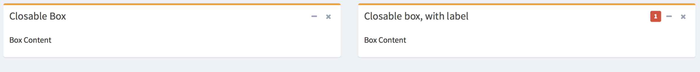
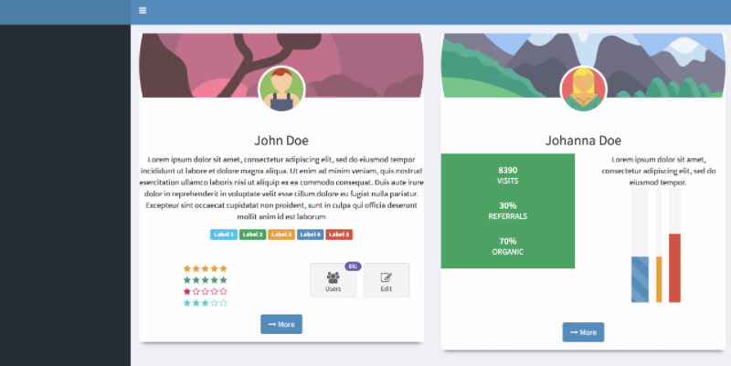

## Improved boxes

With **shinydashboardPlus**, you can add labels and dropdown menus to your
boxes. You just have to use `boxPlus()` instead of `box()` from **shinydashboard**.

There are also other boxes such as `gradientBox()`, `socialBox()` as well as
`widgetUserBox()`, to help you making outstanding shiny apps.

### boxPlus



<br>

```r
library(shiny)
library(shinydashboard)
library(shinydashboardPlus)

 shinyApp(
   ui = dashboardPagePlus(
     dashboardHeaderPlus(),
     dashboardSidebar(),
     dashboardBody(
      fluidRow(
       boxPlus(
        title = "Closable Box", 
         closable = TRUE, 
         status = "warning", 
         solidHeader = FALSE, 
         collapsible = TRUE,
         p("Box Content")
       ),
       boxPlus(
        title = "Closable box, with label", 
         closable = TRUE, 
         enable_label = TRUE,
         label_text = 1,
         label_status = "danger",
         status = "warning", 
         solidHeader = FALSE, 
         collapsible = TRUE,
         p("Box Content")
       )
     )
    )
   ),
   server = function(input, output) {}
 )
```

### gradientBox


<br>

```r
library(shiny)
 library(shinydashboard)
 library(shinydashboardPlus)
 
 shinyApp(
  ui = dashboardPage(
    dashboardHeader(),
    dashboardSidebar(),
    dashboardBody(
     gradientBox(
      title = "My gradient Box",
      icon = "fa fa-th",
      gradientColor = "teal", 
      boxToolSize = "sm", 
      footer = sliderInput(
       "obs", 
       "Number of observations:",
        min = 0, max = 1000, value = 500
       ),
      "This is a gradient box"
      ),
      gradientBox(
      title = "My gradient Box",
      icon = "fa fa-heart",
      gradientColor = "maroon", 
      boxToolSize = "xs", 
      closable = TRUE,
      footer = "The footer goes here. You can include anything",
      "This is a gradient box"
      )
    ),
    title = "Description Blocks"
  ),
  server = function(input, output) { }
 )
```

### widgetUserBox


<br>

```r
 library(shiny)
 library(shinydashboard)
 library(shinydashboardPlus)
 
 shinyApp(
  ui = dashboardPage(
    dashboardHeader(),
    dashboardSidebar(),
    dashboardBody(
     widgetUserBox(
      title = "Nadia Carmichael",
      subtitle = "lead Developer",
      type = 2,
      src = "https://adminlte.io/themes/AdminLTE/dist/img/user7-128x128.jpg",
      color = "yellow",
      "Some text here!",
      footer = "The footer here!"
     ),
     widgetUserBox(
      title = "Alexander Pierce",
      subtitle = "Founder & CEO",
      type = NULL,
      src = "https://adminlte.io/themes/AdminLTE/dist/img/user1-128x128.jpg",
      color = "aqua-active",
      closable = TRUE,
      "Some text here!",
      footer = "The footer here!"
     ),
     widgetUserBox(
      title = "Elizabeth Pierce",
      subtitle = "Web Designer",
      type = NULL,
      src = "https://adminlte.io/themes/AdminLTE/dist/img/user3-128x128.jpg",
      background = TRUE,
      backgroundUrl = "https://images.pexels.com/photos/531880/pexels-photo-531880.jpeg?auto=compress&cs=tinysrgb&h=350",
      closable = TRUE,
      "Some text here!",
      footer = "The footer here!"
     )
    ),
    title = "Description Blocks"
  ),
  server = function(input, output) { }
 )
```

### socialBox


<br>

```r
library(shiny)
 library(shinydashboard)
 library(shinydashboardPlus)
 
 shinyApp(
  ui = dashboardPage(
    dashboardHeader(),
    dashboardSidebar(),
    dashboardBody(
     socialBox(
      title = "Social Box",
      subtitle = "example-01.05.2018",
      src = "https://adminlte.io/themes/AdminLTE/dist/img/user4-128x128.jpg",
      "Some text here!",
      attachmentBlock(
       src = "http://kiev.carpediem.cd/data/afisha/o/2d/c7/2dc7670333.jpg",
       title = "Test",
       title_url = "http://google.com",
       "This is the content"
      ),
      comments = tagList(
       boxComment(
        src = "https://adminlte.io/themes/AdminLTE/dist/img/user3-128x128.jpg",
        title = "Comment 1",
        date = "01.05.2018",
        "The first comment"
       ),
       boxComment(
        src = "https://adminlte.io/themes/AdminLTE/dist/img/user5-128x128.jpg",
        title = "Comment 2",
        date = "01.05.2018",
        "The second comment"
       )
      ),
      footer = "The footer here!"
     )
    ),
    title = "Description Blocks"
  ),
  server = function(input, output) { }
 )
```


### flipBox


<br>

```r
library(shiny)
library(shinydashboard)
library(shinydashboardPlus)
shinyApp(
  ui = dashboardPage(
    dashboardHeader(),
    dashboardSidebar(),
    dashboardBody(
      setShadow("card"),
      fluidRow(
        column(
          width = 6,
          align = "center",
          flipBox(
            id = 1,
            main_img = "https://image.flaticon.com/icons/svg/149/149076.svg",
            header_img = "https://image.flaticon.com/icons/svg/119/119595.svg",
            front_title = "John Doe",
            back_title = "About John",
            "Lorem ipsum dolor sit amet, consectetur adipiscing elit, 
            sed do eiusmod tempor incididunt ut labore et dolore magna 
            aliqua. Ut enim ad minim veniam, quis nostrud exercitation 
            ullamco laboris nisi ut aliquip ex ea commodo consequat. 
            Duis aute irure dolor in reprehenderit in voluptate velit 
            esse cillum dolore eu fugiat nulla pariatur. Excepteur sint 
            occaecat cupidatat non proident, sunt in culpa qui officia 
            deserunt mollit anim id est laborum",
            fluidRow(
              dashboardLabel("Label 1", status = "info"),
              dashboardLabel("Label 2", status = "success"),
              dashboardLabel("Label 3", status = "warning"),
              dashboardLabel("Label 4", status = "primary"),
              dashboardLabel("Label 5", status = "danger")
            ),
            hr(),
            fluidRow(
              column(
                width = 6,
                align = "center",
                starBlock(grade = 5),
                starBlock(grade = 5, color = "olive"),
                starBlock(grade = 1, color = "maroon"),
                starBlock(grade = 3, color = "teal")
              ),
              column(
                width = 6,
                align = "center",
                appButton(
                  url = "http://google.com",
                  label = "Users",
                  icon = "fa fa-users",
                  enable_badge = TRUE,
                  badgeColor = "purple",
                  badgeLabel = 891
                ),
                appButton(
                  label = "Edit",
                  icon = "fa fa-edit",
                  enable_badge = FALSE,
                  badgeColor = NULL,
                  badgeLabel = NULL
                )
              )
            ),
            back_content = tagList(
              column(
                width = 12,
                align = "center",
                sliderInput(
                  "obs", 
                  "Number of observations:",
                  min = 0, 
                  max = 1000, 
                  value = 500
                )
              ),
              plotOutput("distPlot")
            )
          )
        ),
        column(
          width = 6,
          align = "center",
          flipBox(
            id = 2,
            main_img = "https://image.flaticon.com/icons/svg/149/149073.svg",
            header_img = "https://image.flaticon.com/icons/svg/119/119598.svg",
            front_title = "Johanna Doe",
            back_title = "About Johanna",
            fluidRow(
              column(
                width = 6,
                align = "center",
                boxPad(
                  color = "green",
                  descriptionBlock(
                    header = "8390",
                    text = "VISITS",
                    right_border = FALSE,
                    margin_bottom = TRUE
                  ),
                  descriptionBlock(
                    header = "30%",
                    text = "REFERRALS",
                    right_border = FALSE,
                    margin_bottom = TRUE
                  ),
                  descriptionBlock(
                    header = "70%",
                    text = "ORGANIC",
                    right_border = FALSE,
                    margin_bottom = FALSE
                  )
                )
              ),
              column(
                width = 6,
                align = "center",
                "Lorem ipsum dolor sit amet, consectetur adipiscing elit, 
              sed do eiusmod tempor.",
                br(),
                verticalProgress(
                  value = 10,
                  striped = TRUE,
                  active = TRUE
                ),
                verticalProgress(
                  value = 50,
                  active = TRUE,
                  status = "warning",
                  size = "xs"
                ),
                verticalProgress(
                  value = 20,
                  status = "danger",
                  size = "sm",
                  height = "60%"
                )
              )
            ),
            back_content = tagList(
              column(
                width = 12,
                align = "center",
                radioButtons(
                  "dist", 
                  "Distribution type:",
                  c("Normal" = "norm",
                    "Uniform" = "unif",
                    "Log-normal" = "lnorm",
                    "Exponential" = "exp"
                  )
                )
              ),
              plotOutput("plot")
            )
          )
        )
      )
    ),
    title = "flipBox"
  ),
  server = function(input, output) {
    output$distPlot <- renderPlot({
      hist(rnorm(input$obs))
    })
    output$plot <- renderPlot({
      dist <- switch(input$dist,
                     norm = rnorm,
                     unif = runif,
                     lnorm = rlnorm,
                     exp = rexp,
                     rnorm)
      
      hist(dist(500))
    })
  }
)
```